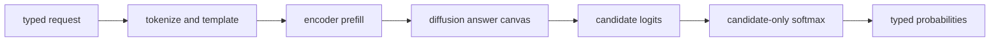

# Jev Bush


> Jev Bush is a CPU-first probabilistic decision engine for DiffusionGemma.
>
> Please clap.

Jev Bush turns state, a natural-language predicate, and an explicit candidate
set into a normalized probability distribution. It reads candidate logits
directly: it never generates free-form text or parses model-written JSON.

The implementation is a small C11 library and CLI specialized for the public
DiffusionGemma 26B text checkpoints. The checked-in [`jb.c`](jb.c) is a
generated amalgamation; applications can instead build `libjb` and use the
public [`jb.h`](jb.h) API. CPU inference needs only a C compiler and `libm`.
OpenMP is optional.



## Status and scope

Jev Bush is an educational, correctness-first implementation and an embeddable
C library. It supports OpenJev's Noul/boolean, Choice, and Score/ordinal
decisions; exact schema-prefix reuse; batched inputs; deterministic JSONL
output; and the public OpenJev evaluation set.

The project is deliberately narrow:

- DiffusionGemma 26B BF16 and NVIDIA NVFP4 text checkpoints only
- CPU-first scalar, AVX2, AVX-512, and Arm NEON kernels
- optional CUDA validation/benchmark backend, not a general GPU runtime
- no generation, sampling loop, server, HTTP transport, image tower, generic
  model framework, or generic safetensors reader
- batch size at most 16, 4,096 prompt tokens, 64 tokens per answer canvas,
  4,096 total batched canvas tokens, and one denoising step

Strict scalar execution defines canonical results. Strict NEON, exact AVX-512,
and strict CUDA reproduce those results bit for bit. AVX2 is deterministic but
uses a different reduction order. Fast-math builds intentionally trade exact
reproducibility for throughput.

For production GPGPU inference, use
[OpenJev](https://github.com/razorback16/openjev) or
[SemIf](https://github.com/TheoLeeCJ/SemIf). Jev Bush's optional CUDA path
exists to validate semantics and measure the same model on another backend;
CPU-native inference remains the point of the project.

## Build

The Makefile builds the CLI plus static and shared libraries:

```sh
make
make check
```

Enable OpenMP explicitly when the compiler supports it:

```sh
make OMPFLAGS=-fopenmp
```

Or build the amalgamation directly on Linux:

```sh
cc -O3 -march=native -std=c11 -Wall -Wextra -pedantic \
  -fopenmp jb.c -lm -o jb
```

For the evaluated fast-math build, add `-ffast-math`. Fast math can change
probabilities and can make results depend on prefix-cache or batch shape. Do
not use it where canonical reproducibility is required.

Useful build variants:

```sh
# Portable scalar reference
cc -O3 -DJB_SCALAR -std=c11 jb.c -lm -o jb

# AVX2/FMA binary with no AVX-512 code
cc -O3 -mavx2 -mfma -mno-avx512f -DJB_AVX2_ONLY \
  -std=c11 -fopenmp jb.c -lm -o jb

# macOS, portable CPU build
cc -O3 -std=c11 jb.c -lm -o jb

# Windows, from a Visual Studio developer prompt
cl /O2 /std:c11 /experimental:c11atomics jb.c
```

On GCC and Clang x86 builds, runtime dispatch selects AVX-512, AVX2, or scalar
kernels. Strict AVX-512 creates an exact row-lane weight image at load time;
this improves exact execution but raised peak resident memory to about 37 GB in
the recorded 27B NVFP4 run. The compact fast path typically used 15--17 GB.

The optional Linux CUDA build uses no CUDA headers or `nvcc`; it loads the CUDA
driver and NVRTC at runtime:

```sh
cc -O3 -march=native -DJB_CUDA -std=c11 -fopenmp \
  jb.c -lm -ldl -lpthread -o jb
```

Without a suitable driver, NVRTC, or device it falls back to CPU kernels. A
CUDA-enabled library retains its CUDA primary context, module, and loaded
libraries for process lifetime and must not be unloaded with `dlclose`.

## CLI

```sh
./jb MODEL_DIR decide examples/request.json
./jb MODEL_DIR eval typed-decisions.jsonl
./jb --check-request examples/request.json
./jb --selftest
./jb --bench-kernels
```

`MODEL_DIR` is a local copy of either:

- `google/diffusiongemma-26B-A4B-it` (BF16)
- `nvidia/DiffusionGemma-26B-A4B-IT-NVFP4`

Jev Bush memory-maps the checkpoint's fixed shard layout and reads its
`tokenizer.json` directly. Unknown dtypes, layouts, request shapes, or model
variants are rejected.

[`examples/request.json`](examples/request.json) demonstrates all three
decision types. Results contain stable identifiers, every candidate
probability, the selected candidate, and minimal timing/usage metadata. One
input looks like this:

```json
{
  "id": "case-1",
  "state": "A customer cannot sign in.",
  "questions": {
    "urgent": {
      "type": "noul",
      "instructions": "This needs action today.",
      "criteria": {"true": "Yes.", "false": "No."}
    },
    "route": {
      "type": "choice",
      "instructions": "Who owns it?",
      "criteria": {"billing": "Billing.", "technical": "Technical."}
    },
    "severity": {
      "type": "score",
      "instructions": "How severe is it?",
      "criteria": ["low", "medium", "high"]
    }
  }
}
```

Requests with duplicate object keys, `\\u0000`, nesting deeper than 256
levels, or an overlong prompt are rejected. OpenJev-compatible templating treats
special-token spellings in request text as control tokens; callers accepting
untrusted text should strip or escape them.

### Prefix reuse and batching

`eval` retains one immutable exact-match schema-prefix K/V entry. The first row
for a schema is a miss; subsequent token-identical prefixes evaluate only the
document suffix. Strict cached and monolithic results are byte-identical.
`decide` remains monolithic.

Consecutive cache hits can be microbatched:

```sh
OMP_NUM_THREADS=32 JB_MICROBATCH=4 ./jb MODEL_DIR eval requests.jsonl
```

`JB_MICROBATCH` accepts 1 through 16 and defaults to 1. Incompatible rows and
batches whose K/V exceeds the 4 GiB default limit run sequentially. Override
that compile-time limit with `-DJB_MICROBATCH_KV_LIMIT=BYTES`. Microbatching
improves throughput rather than single-request latency.

## C library

The public API separates an immutable, thread-safe model from mutable sessions:

```c
jb_model *model = NULL;
jb_session *session = NULL;
jb_result *result = NULL;

jb_status status = jb_model_load(model_directory, &model);
if (status == JB_OK)
    status = jb_session_create(model, &schema, &session);
if (status == JB_OK)
    status = jb_session_decide(session, &input, &result);

jb_result_free(result);
jb_session_free(session);
jb_model_free(model);
```

See [`examples/library.c`](examples/library.c) for a complete typed example.
The library also exposes JSON adapters and batch calls:

- `jb_session_decide` / `jb_session_decide_batch`
- `jb_session_decide_json` / `jb_session_decide_json_batch`

Typed calls enter the decision engine directly; they do not serialize and
reparse JSON internally. A model may be shared by sessions on different
threads. A session owns its K/V cache, prefix state, and reusable workspace and
permits one active call at a time. Results own their data and are released with
`jb_result_free` or `jb_results_free`.

`jb_model_load_ex` accepts custom allocator and logger callbacks. Public
structures carry `struct_size` and API-version fields where ABI negotiation is
needed. Functions return `jb_status`; inspect `jb_session_last_error` for a
session operation or thread-local `jb_last_error` otherwise. See [`jb.h`](jb.h)
for the complete ownership, error, and callback contracts.

Install the library, header, and `pkg-config` metadata with:

```sh
make install PREFIX=/usr/local
```

## Decision semantics

Jev Bush implements OpenJev's bounded diffusion read:

1. Assign each decision a one-token label in a fixed answer template.
2. Replace only those label slots with seeded vocabulary tokens.
3. Prefill the prompt and run one bidirectional decoder read over the answer
   canvas using cached encoder K/V.
4. Project answer slots through the tied LM head and apply the checkpoint's
   `30 * tanh(logit / 30)` softcap.
5. Normalize only declared candidate logits with stable softmax:
   `p_i = exp(z_i - max(z)) / sum_j exp(z_j - max(z))`.

Boolean candidates map to `yes`/`no`, ordinal scores to decimal labels, and
choices to stable alphabetic labels. Long candidate descriptions therefore do
not become autoregressive sequence likelihoods; the model scores their bound
answer labels. Output contains no generated prose.

Canonical JSON hashed with SHA-256 seeds a Python-compatible MT19937 canvas, so
identical requests are deterministic. `samples: N` requests exactly `N` reads.
Without it, OpenJev's entropy rule chooses one or four. Additional reads execute
as isolated canvases in one decode and are byte-identical in strict mode to
running them separately.

Requests with more than 16 decisions are split into groups of at most eight
answer canvases. They share prompt K/V, while attention masks isolate their
answer tokens. This lets matrix and expert kernels reuse weight tiles without
changing strict results.

## Architecture

The readable implementation lives in focused include modules and is assembled
into the distributable root file by `tools/amalgamate.py`:

| module | responsibility |
|---|---|
| `src/foundation.inc` | platform, error, cleanup, allocator, and arena primitives |
| `src/json.inc` | bounded JSON parsing and emission |
| `src/model.inc` | tokenizer, safetensors validation, mapping, and model ownership |
| `src/kernels_*.inc` | scalar, AVX2, AVX-512, NEON, and runtime dispatch |
| `src/cuda.inc` | optional dynamically compiled CUDA operations |
| `src/engine.inc` | transformer, K/V, attention, FFN, and MoE execution |
| `src/decision.inc` | OpenJev request semantics and candidate scoring |
| `src/api.inc` | public typed and JSON library API |
| `src/cli_tests.inc` | CLI, self-tests, and kernel benchmarks |

Do not hand-edit generated [`jb.c`](jb.c). After changing a module, run
`make format` and regenerate it with `make`.

## Validation

Fast local checks:

```sh
make check
make debug
make sanitize
make lint
```

`make check` verifies the amalgamation, error and parallel-region boundaries,
scalar/SIMD primitives, API behavior, allocation-failure cleanup, and request
validation. The repository also contains ThreadSanitizer and model-backed
golden/invariance tools. The pinned golden fixture and hashes are in
[`benchmarks/golden-fixture.json`](benchmarks/golden-fixture.json).

To validate strict cache, batch, and sequential-canvas invariance against a
real checkpoint:

```sh
OMP_NUM_THREADS=32 python3 tools/check_strict_invariance.py \
  ./jb MODEL_DIR typed-decisions.jsonl
```

Install the repository's optional formatting/lint pre-commit hook with:

```sh
make install-hooks
```

## OpenJev evaluation

The Python evaluation tools use only the standard library:

```sh
python3 tools/fetch_openjev.py typed-decisions.jsonl

OMP_NUM_THREADS=32 OMP_PROC_BIND=spread OMP_PLACES=cores \
  python3 tools/run_openjev_eval.py ./jb MODEL_DIR typed-decisions.jsonl \
  predictions.jsonl --jobs 2 --samples 1

python3 tools/score_openjev.py typed-decisions.jsonl predictions.jsonl
python3 tools/summarize_eval.py predictions.jsonl
```

Set worker and OpenMP thread counts for the machine and avoid oversubscribing
cores. The recorded 64-core Threadripper run used two workers with 32 threads
each.

### Established results

The pinned `LocalLLaMA/typed-decisions` test set contains 400 rows and 2,000
decisions. Full provenance, hashes, hardware, policy notes, calibration data,
and timing details are recorded in
[`benchmarks/established-results.json`](benchmarks/established-results.json).

| engine and policy | accuracy | log loss | Brier | ECE |
|---|---:|---:|---:|---:|
| Jev Bush BF16, strict, one read | **67.40%** | 1.6134 | 0.3350 | 0.2523 |
| OpenJev NVFP4, one read | 66.60% | 1.4747 | 0.3205 | 0.2446 |
| OpenJev NVFP4, automatic reads | 66.80% | **1.3940** | **0.3107** | **0.2352** |
| Jev Bush NVFP4, strict, one read | 66.10% | 1.5476 | 0.3268 | 0.2540 |
| Jev Bush NVFP4, fast CPU, one read | 66.80% | 1.5777 | 0.3272 | 0.2454 |
| Jev Bush NVFP4, strict portable, automatic reads | 65.95% | 1.4296 | 0.3168 | 0.2442 |
| Jev Bush NVFP4, fast CUDA, automatic reads | 66.70% | 1.4398 | 0.3164 | 0.2409 |

One-read Jev Bush NVFP4 and OpenJev agree on 92.70% of argmax decisions; mean
candidate-distribution total variation is 0.0765. This establishes comparable
bounded-decision behavior on this dataset, not equivalence to Jev training,
calibration, generality, or service performance.

Selected performance observations:

- A fast CPU build on a 64-core Threadripper 9980X, using two 32-thread
  workers, averaged 5.49 s/row and 0.911 decisions/s per worker.
- Exact schema-prefix reuse reduced the recorded warm five-decision document
  from 6.29 s cold to 2.20 s, with byte-identical strict answers.
- CPU microbatch 4 raised strict throughput from 2.27 to 2.50 predicates/s on
  the prefix-cache workload.
- Fast CUDA on a DGX Spark averaged 268 ms per one-read row, excluding model
  load. OpenJev on an RTX PRO 6000 averaged 54.2 ms/row.

The same 400-row, 2,000-decision set was rerun on one NVIDIA RTX PRO 6000
Blackwell Max-Q with commit `d0c11b7`, the NVFP4 checkpoint, one worker, and 32
host threads. Wall time includes model loading; mean row latency and
decisions/s use the sum of the rows' internal timings and exclude model load.

| RTX PRO 6000 CUDA mode | reads | wall time | mean row | decisions/s | accuracy |
|---|---:|---:|---:|---:|---:|
| fast, one read | 400 | 59.86 s | 142.8 ms | 35.02 | 66.25% |
| strict/exact, one read | 400 | 140.44 s | 343.7 ms | 14.55 | 66.25% |
| fast, automatic reads | 1,504 | 79.46 s | 191.3 ms | 26.14 | 66.20% |
| strict/exact, automatic reads | 1,498 | 194.69 s | 479.3 ms | 10.43 | 65.95% |

Against the recorded DGX Spark runs, the RTX PRO 6000 was 1.88x faster by
fast one-read row latency (268 vs 142.8 ms), 2.05x faster by fast automatic
wall time (163 vs 79.46 s), and 2.25x faster by strict automatic wall time
(439 vs 194.69 s). Both strict runs reproduced all 2,000 prior strict CUDA
answer objects exactly. The benchmark used the installed CUDA 13.0 NVRTC via
`LD_LIBRARY_PATH=/usr/local/lib/ollama/mlx_cuda_v13`; NVRTC 13.2 generated
kernels that the host's CUDA 13.0 driver could not load. Another process
retained 59.2 GiB on the device but was at 0% SM before each run; monitoring
showed Jev Bush sustaining 76--95% SM without observed competing GPU 0 work.

Hardware, read policy, model format, math mode, and concurrency materially
affect these numbers. Use the machine-readable record rather than quoting a
number without its conditions. Development history and future experiments live
in [`docs/roadmap.md`](docs/roadmap.md).

## License

[0BSD](LICENSE): use, copy, modify, and distribute Jev Bush for any purpose,
with or without fee and without an attribution requirement.
